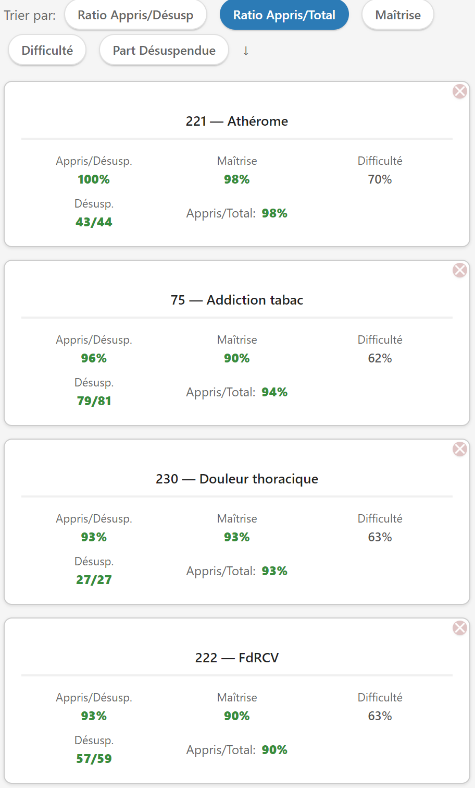
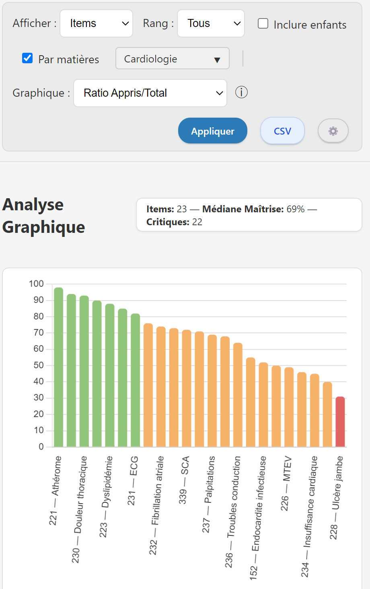
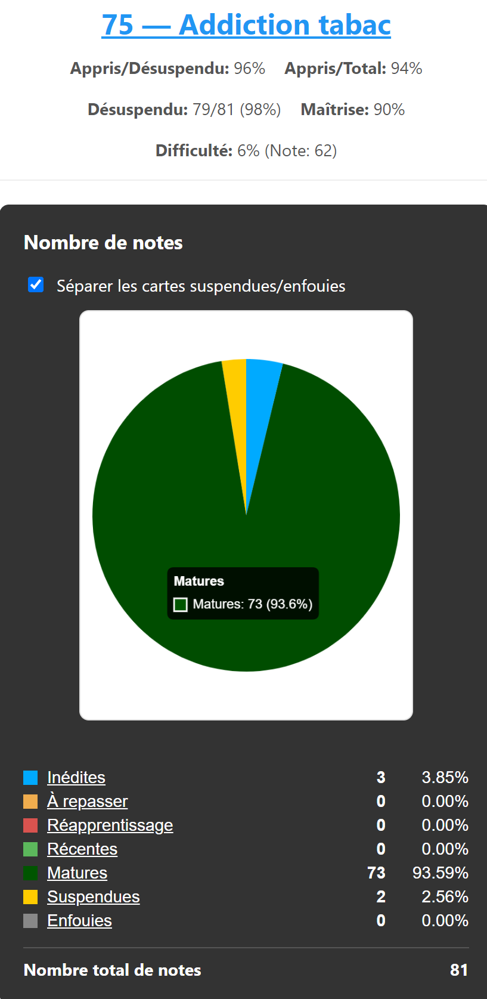

# EDN Progress - Statistiques pour Anki EDN

  

## 📊 Vue d'ensemble

**EDN Progress** est un module complémentaire conçu pour les utilisateurs du [**deck Anki EDN**](https://c2su.github.io/Anki_EDN/Anki_EDN.html) (gratuit et communautaire). Il offre une visualisation complète et dynamique de votre progression, de vos révisions passées et de vos charges de travail futures.

## ✨ Fonctionnalités

### 📈 Graphiques Interactifs de Progression
- **Visualisation par items** : Suivez précisément votre avancement item par item.
- **Visualisation par matières** : Synthétisez votre progression par grande matière médicale.
- **Visualisation SDD** : Affichez votre avancement selon la classification des structures de soins.

### ⏱️ Historique & Prévisions (Nouvel Onglet)
Accédez à un tout nouvel onglet d'analyse temporelle pour mieux piloter vos révisions :
- 📊 **Fiabilité de rétention** : Suivi au jour le jour du taux de réussite sur vos cartes à réviser.
- 📉 **Volume & Backlog** : Visualisation combinée du nombre de révisions effectuées, du temps d'étude quotidien (en minutes) et de l'évolution du retard accumulé (Backlog).
- 🔮 **Prévisions FSRS** : Comparaison entre les révisions planifiées par Anki et une simulation prédictive de propagation FSRS (prenant en compte votre charge théorique future).

### 🔍 Métriques & Filtres Avancés
- 🎯 **Difficulté & Maîtrise** : Calcul des ratios cartes matures / total, et ratio cartes apprises / déstages.
- 🏷️ **Filtres de rang** : Ciblez uniquement le Rang A, les Rangs B/C, ou toutes les cartes.
- 👶 **Filtre Pédiatrie** : Option pour exclure ou inclure les cartes pédiatriques de vos statistiques globales.
- 📁 **Export CSV** : Exportez facilement vos données de progression pour vos analyses externes.

### 🃏 Réglages Visuels des Cartes (EDN)
Centralisé via le menu `Réglages Cartes EDN` :
- Modifie l'affichage de vos cartes pour y ajouter la coloration selon le rang (A, B, C), les pictogrammes de matières médicales (ordinateurs et mobiles), et des bordures dynamiques basées sur vos drapeaux Anki.

## 🚀 Installation

### Depuis AnkiWeb (Recommandé)
1. Ouvrir Anki.
2. Allez dans `Outils > Modules complémentaires > Acquérir des modules complémentaires...`
3. Entrez le code : `1674438508`
4. Redémarrez Anki.

### Installation Manuelle
1. Télécharger le fichier `.ankiaddon` depuis les releases.
2. Allez dans `Outils > Modules complémentaires > Installer depuis un fichier...`
3. Sélectionnez le fichier téléchargé et redémarrez Anki.

## 📖 Utilisation

### Accès
- **Menu** : `Anki EDN → 📊 EDN Progress`
- **Raccourci** : `Ctrl+U`

### Interface Principale

#### Vue Globale
- Utilisez la barre supérieure pour filtrer par Rang, type de vue (Items / Sujets / SDD), et trier les données.
- Cliquez sur un élément pour zoomer ou voir le détail de ses sous-catégories.

#### Historique & Prévisions (Nouvel onglet)
- Basculez sur l'onglet **Historique & Prévisions** en haut à gauche.
- Ajustez la fenêtre d'historique (30, 90, 180 jours) et la fenêtre de prévision (30, 90 jours) pour actualiser instantanément vos graphiques interactifs.

## 🛠️ Compatibilité

- **Anki** : Version 23.10 ou supérieure recommandée (Requis pour l'intégration FSRS).
- **Système** : Qt6 (Windows, macOS, Linux).
- **Deck Requis** : Conçu spécifiquement pour le [**Deck Anki EDN**](https://c2su.github.io/Anki_EDN/Anki_EDN.html).

## ❓ FAQ
### Puis-je l'utiliser sans le deck EDN ?
L'addon cherche des structures spécifiques de tags (`EDN::item-XXX`). Il fonctionnera techniquement avec d'autres decks mais l'utilité sera grandement limitée.

### Pourquoi mes graphiques d'historique ne s'affichent pas ?
Assurez-vous d'avoir coché les paramètres d'historique adéquats et d'avoir effectué des révisions sur le deck EDN durant la période sélectionnée.

## 🔗 Liens
- [**Deck Anki EDN**](https://c2su.github.io/Anki_EDN/Anki_EDN.html)
- [**Discord**](https://discord.gg/2A7zHAEBYt)
- [**GitHub Repository**](https://github.com/C2SU/Anki_EDN_Stats)
- [**AnkiWeb Page**](https://ankiweb.net/shared/info/1674438508)